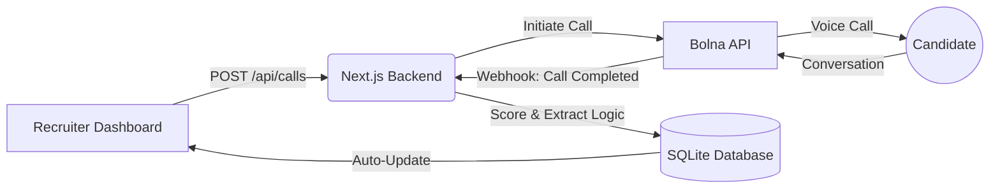

# RecruitAI 🤖: AI-Powered HR Candidate Pre-Screening Platform

> **Bolna Full Stack Engineer Assignment Submission**
> Built with Next.js, Prisma, and Bolna Voice AI

## 📋 Assignment Objectives Checklist

✅ **1. Enterprise Use Case**: HR Recruiting (Automated Initial Phone Screens). Defined problem, workflow, and outcome metrics below.
✅ **2. Voice AI Agent on Bolna**: Built "Aria," an AI Recruiter. Uses structured prompts to extract experience, salary expectations, and notice period. Integrates via Webhooks and the Bolna Call API.
✅ **3. Web App Wrapper**: A full-stack Next.js dashboard for recruiters to manage jobs, trigger AI calls, and review scored candidates.
✅ **4. Full Flow Demonstration**: User triggers call -> Agent screens candidate -> Webhook hits Next.js API -> Backend extracts answers & scores candidate -> Dashboard updates dynamically.
✅ **5. Deployment & Repo**: Hosted on GitHub, ready for Vercel deployment.

---

## 🎯 1. Real Enterprise Use Case

**The Problem**: HR recruiters at mid-to-large enterprises spend 60–70% of their day conducting repetitive, top-of-funnel phone screens just to ask basic qualifying questions (salary expectations, notice period, basic skills). This creates a massive bottleneck in the hiring pipeline.

**The Workflow Solution**:
1. Recruiter uploads candidates to the RecruitAI Dashboard.
2. Recruiter clicks **"Screen"**, triggering Bolna's AI Voice Agent to call the candidate immediately.
3. The AI conducts a friendly, structured 5-minute interview, extracting specific required data points.
4. The backend receives the call transcript via Webhook, parses the answers, and applies a custom scoring algorithm.
5. The Recruiter reviews the dashboard the next morning to see a ranked list of "Shortlisted" candidates with full transcripts and AI summaries.

**Outcome Metrics**:
- 📞 **5x increase** in top-of-funnel candidate screening volume (from ~8 manual calls/day to 40+ automated calls/day).
- ⏱️ **~3 hours/day saved** per recruiter, allowing them to focus on deep, late-stage behavioral interviews.
- 🎯 **60% reduction** in time-to-shortlist metrics.

---

## 🏗️ 2. Full System Architecture & Flow



### Backend Logic & Scoring Engine
When the webhook is received, the backend doesn't just display the transcript. It evaluates the candidate out of 100 points:
- **Experience Match (30%)**: Checks the transcript against required job skills.
- **Availability (20%)**: Evaluates notice period.
- **Salary Fit (25%)**: Compares extracted salary expectations vs. job budget.
- **Communication (25%)**: Evaluates transcript clarity and length.

Candidates scoring **80+** are automatically tagged as **Shortlisted ✓**, while those under **60** are marked as **Rejected**.

---

## 🛠️ Tech Stack

| Layer | Technology | Purpose |
|-------|-----------|---------|
| **Frontend** | Next.js 14 (App Router) | React framework for UI |
| **Styling** | Custom CSS | Clean, professional SaaS light theme |
| **Database** | Prisma ORM + SQLite | Fast, local relational database |
| **Voice AI** | Bolna API | Initiating calls and AI conversational logic |
| **Deployment** | Vercel | Seamless edge deployment |

---

## 🚀 Quick Start Guide

### 1. Clone & Install
```bash
git clone https://github.com/raghul017/Bolna.git
cd recruit-ai
npm install
```

### 2. Set Up Environment
Create a `.env` file:
```env
DATABASE_URL="file:./prisma/dev.db"
BOLNA_API_KEY="your_bolna_api_key_here"
BOLNA_AGENT_ID="your_bolna_agent_id_here"
NEXT_PUBLIC_APP_URL="http://localhost:3000"
```

### 3. Initialize Database
```bash
npx prisma generate
DATABASE_URL="file:./prisma/dev.db" npx prisma db push
npx ts-node --skip-project --compiler-options '{"module":"CommonJS"}' prisma/seed.ts
```

### 4. Run Dev Server
```bash
npm run dev
```

---

## 📡 Bolna Agent & Webhook Setup

1. Sign up at **app.bolna.dev**.
2. Go to the Settings page in the RecruitAI app (`/settings`) and copy the **System Prompt**.
3. Create a new Agent on Bolna and paste the prompt.
4. Under the Agent's Webhook settings, paste your Vercel deployment URL (or ngrok local URL) followed by `/api/webhooks/bolna`.
5. *Important for Trial Accounts*: Add your real phone number to Bolna's "Verified Numbers" list before testing the "Screen" button.
